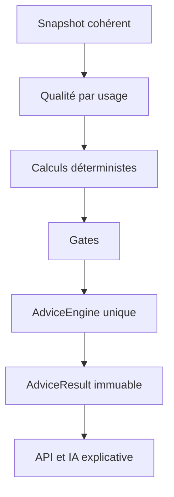

# Flux de données et de décision

## Ingestion large

1. Un adaptateur reçoit une donnée sans l'interpréter.
2. L'enveloppe source est validée : schéma, heure, unité, droit, limite et identifiant.
3. L'instrument est résolu vers `InstrumentId` ou mis en quarantaine.
4. L'observation brute est conservée immuablement si sa licence l'autorise.
5. Une forme canonique est produite avec provenance et `input_hash`.
6. Les doublons sont absorbés par identifiant source puis empreinte déterministe.
7. Le Data Fusion Hub groupe actualités, événements, faits et signaux reliés.
8. Les jobs de calcul sont écrits dans l'outbox dans la même transaction.

## Filtrage de l'information

Le filtre ne supprime pas silencieusement les données. Il produit une file expliquée à partir de priorités lexicographiques :

1. incident de sécurité ou de qualité ;
2. position manuelle ;
3. thèse ou alerte active ;
4. watchlist ;
5. instrument analysé récemment ;
6. événement marché global ;
7. nouveauté, fraîcheur et fiabilité de la source.

Chaque item conserve `relevance_reasons[]`. L'utilisateur peut afficher « pourquoi je vois ceci ? » et « éléments masqués ».

## Calcul et conseil

Une alerte TradingView provoque une nouvelle cotation IBKR et une réévaluation locale. Son prix ou son signal ne devient jamais automatiquement la vérité finale.

## Publication UI

L'API publie un signal SSE léger. Le client recharge ensuite le snapshot canonique via REST. Les données anciennes peuvent rester visibles pendant un rafraîchissement, mais leur âge et leur état ne sont jamais masqués.
