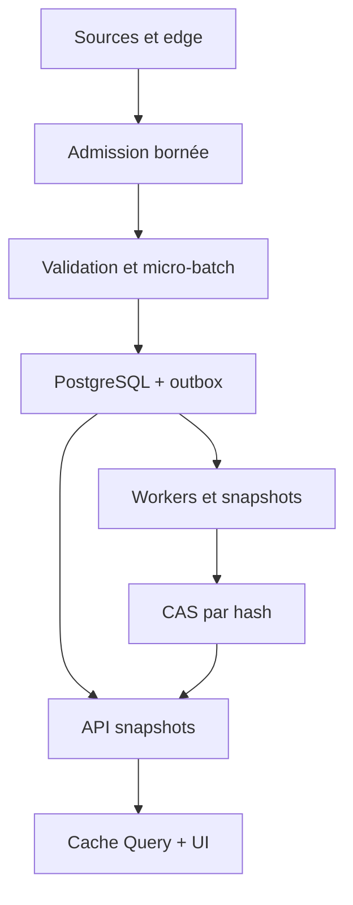

# Hot paths, cache et maîtrise de la charge

## Statut et intention

Ce document fixe l'architecture de performance de Vertex One en mode local-first. Il ne promet aucune latence : les nombres vivent dans `manifests/performance-budgets.yaml`, ont le statut `provisional_target` et doivent être confirmés sur la machine de référence par `docs/06-quality/PERFORMANCE_TEST_PLAN.md`.

La performance ne peut jamais modifier la vérité financière. Un cache, un batch, un downsampling ou une file ne peut ni faire passer une donnée périmée pour live, ni compléter une chaîne partielle, ni créer un second calcul autoritaire.

## Principes obligatoires

1. PostgreSQL reste la vérité transactionnelle et l'outbox la file durable locale.
2. Redis, Celery, TimescaleDB et tout cache distribué sont absents de la v1 par défaut.
3. Toute file en mémoire est bornée, observable et possède une politique de saturation explicite.
4. Les calculs CPU, agrégations lourdes, scans Parquet et transformations columnaires restent hors de l'event loop FastAPI.
5. Les données volumineuses sont lues par projection, prédicat, batch et résolution demandée, jamais matérialisées intégralement par habitude.
6. Une chaîne d'options est chargée progressivement par sous-jacent, classe de trading, expiration et fenêtre de strikes.
7. Les artefacts dérivés lourds sont immuables et adressés par hash ; un nouveau calcul crée une nouvelle clé.
8. Le navigateur reçoit des snapshots et des invalidations ciblées, pas un flux incontrôlé de payloads complets.
9. Les graphiques reçoivent au plus la résolution utile au viewport et conservent les extrêmes, gaps, sessions, unités et provenance.
10. `stale`, `partial`, `delayed` et `offline` sont des états de données, pas des erreurs à masquer par un cache.

## Vue d'ensemble



`LISTEN/NOTIFY` réveille les consommateurs ; les tables restent durables. PostgreSQL documente que `SKIP LOCKED` convient à plusieurs consommateurs d'une table de type file, tout en produisant une vue incohérente impropre aux lectures métier générales. Le mécanisme est donc limité aux leases de l'outbox, avec ordre déterministe, retry et idempotence.

## Hot paths canoniques

### HP-01 — Quote IBKR vers écran

```text
edge_received → validated → db_committed → quality_evaluated
→ snapshot_published → sse_invalidated → api_refetched → ui_painted
```

- Le callback source copie le minimum nécessaire et retourne rapidement.
- Une admission bornée sépare réception et écriture ; la saturation ralentit ou réduit les demandes futures avant d'accumuler sans limite.
- Les petites écritures compatibles sont regroupées dans un micro-batch borné par nombre de lignes **et** temps d'attente.
- L'observation, son statut de qualité, le snapshot et l'événement outbox sont cohérents transactionnellement.
- SSE transporte `resource_type`, `resource_id`, `version`, `input_hash` et `as_of`, pas la quote complète.
- TanStack Query invalide la clé exacte, annule la requête devenue inutile et recharge le snapshot canonique.
- Une mise à jour remplace la dernière barre avec `series.update`; `setData` reste réservé au chargement initial ou au remplacement intentionnel d'une série.

La coalescence « latest wins » est permise pour les **notifications UI remplaçables**. Elle ne supprime jamais un événement durable, une révision, une transition de qualité ou une observation dont la conservation est requise.

### HP-02 — Alerte TradingView vers nouvelle évaluation

```text
webhook_received → schema_and_replay_checked → queue_committed → ack
→ edge_pulled → fresh_ibkr_quote → snapshot → calculation → advice_persisted
```

- Le Worker public valide taille, schéma, secret, timestamp, nonce et idempotence avant l'acquittement.
- L'acquittement confirme uniquement la mise en file durable, jamais un calcul ou un verdict.
- Le processus local récupère l'événement avec débit borné et priorité inférieure aux opérations de reconnexion/santé.
- Le prix de l'alerte ne devient pas la vérité ; une observation IBKR fraîche est demandée puis évaluée localement.
- Si la fraîcheur, le droit ou la couverture manque, le résultat devient `BLOCKED` ou `INSUFFICIENT_DATA`.
- La limite officielle TradingView de trois secondes concerne la réponse du webhook ; le budget interne laisse une marge et exclut tout calcul lourd de cette réponse.

### HP-03 — Lecture d'une page

```text
navigation → query_key → cache_probe → snapshot_query
→ dto_validation → transfer → react_commit → dominant_visual_ready
```

- Chaque page demande un snapshot préparé répondant à sa question principale.
- L'API évite les cascades N+1 et fournit un DTO cohérent à un même `as_of`.
- Les lectures utilisent index et pruning prouvés par `EXPLAIN (ANALYZE, BUFFERS, WAL, SETTINGS)` sur données synthétiques représentatives.
- Le cache TanStack Query est indexé par identité canonique, version de contrat, filtres, résolution et hash/version du snapshot.
- `staleTime` dérive de `stale_after` et du cas d'usage ; la valeur par défaut de la bibliothèque n'est pas une politique financière.
- Une donnée précédente peut rester affichée pendant un refetch avec son âge et un état visuel explicites.

### HP-04 — Chaîne d'options lazy

Le système ne demande ni ne rend une chaîne complète par défaut.

1. Charger le sous-jacent exact, les expirations et `trading_class` disponibles.
2. L'utilisateur choisit une expiration ; charger une fenêtre de strikes autour du spot, avec puts/calls et contrats exacts.
3. Publier un premier lot utilisable avec `coverage_status=PARTIAL` si la couverture n'est pas encore suffisante.
4. Enrichir OI, volume, quotes et Greeks par batches bornés, en respectant pacing et lignes de marché.
5. Charger ailes, autres expirations ou historique seulement sur intention explicite.
6. À l'échéance du délai de collecte, afficher reçu/attendu/manquant et conserver l'état partiel ; ne jamais inventer les lignes absentes.

La clé de cache inclut au minimum : sous-jacent, `ibkr_con_id`, `trading_class`, expiration, ensemble exact de contrats, entitlement, type live/delayed, epoch de connexion, politique de fraîcheur et hash des observations.

### HP-05 — Fusion actualités, événements, entreprise et ETF

- Les événements durables sont ingérés individuellement puis enrichis en batches bornés.
- La normalisation et la résolution d'identité précèdent la déduplication.
- Les clusters et vues préparées sont recalculés par entrées modifiées, pas par rescannage global.
- Le batch s'arrête sur limite de lignes, octets ou temps ; aucune de ces limites n'est infinie.
- Un batch incomplet publie sa couverture et planifie la suite via outbox.
- Les imports historiques et sources primaires utilisent lecture columnar lazy lorsque le benchmark le justifie.

### HP-06 — Calcul quantitatif et décision

- L'API valide et enregistre la demande ; le worker réalise les calculs lourds.
- Les travaux identiques sont coalescés par clé de calcul ; un résultat existant n'est réutilisé que si l'ensemble des hashes, versions et hypothèses correspond exactement.
- Chaque job possède deadline, priorité, cancellation cooperative, mémoire maximale, seed éventuelle et progression.
- Le pool CPU est borné pour laisser de la capacité à l'API, PostgreSQL et l'edge.
- L'outbox garantit la reprise ; le cache ne remplace pas `CalculationRecord` ni `AdviceResult`.

### HP-07 — Historique et graphique

- L'API accepte plage, timeframe, largeur utile du viewport et densité maximale.
- PostgreSQL sert les fenêtres courtes/chaudes ; un artefact Parquet/Arrow adressé par hash peut servir les historiques dérivés si son adoption et sa licence sont validées.
- Polars lazy ou PyArrow Dataset projette seulement les colonnes demandées et pousse filtres/prédicats vers le scan lorsque le plan le confirme.
- Le backend agrège à la résolution utile avant sérialisation ; le navigateur ne reçoit pas des millions de points pour en cacher la majorité.
- Le pan/zoom demande des fenêtres adjacentes et annule les requêtes obsolètes.

## Admission, backpressure et priorité

### Files bornées

Python documente qu'une `asyncio.Queue(maxsize > 0)` suspend `put()` lorsqu'elle est pleine. Vertex complète ce comportement par un timeout, un compteur de saturation et une politique par type de message. Une file sans limite est interdite.

| Classe | Exemples | Saturation |
|---|---|---|
| P0 contrôle | reconnexion, epoch, santé, shutdown | capacité réservée ; jamais drop silencieux |
| P1 demande utilisateur | quote fraîche, expiration sélectionnée | attente bornée, annulation de la demande remplacée, état `partial/error` |
| P2 événement durable | webhook, news, corporate event, outbox | persister ou refuser explicitement ; jamais drop |
| P3 fond | scanner, préchargement, refresh non visible | ralentir, différer, fusionner les travaux identiques |
| P4 backfill | historique et recherche | pause/cancel jusqu'au retour sous seuil |

Seuils initiaux : `normal < 75 %`, `high_water ≥ 75 %`, `critical ≥ 90 %`, `full = 100 %`. Ces valeurs sont des paramètres provisoires du manifeste. La sortie du mode dégradé exige un hysteresis ; elle ne bascule pas à chaque élément.

### Politique de surcharge

1. Refuser d'abord nouveau préchargement et backfill.
2. Réduire la concurrence et la taille des fenêtres optionnelles.
3. Coalescer invalidations et jobs identiques.
4. Servir le dernier snapshot avec âge et état si le cas d'usage le permet.
5. Répondre `429`/`503` avec `Retry-After` aux demandes non durables impossibles à admettre.
6. Conserver événements durables et transitions de sécurité ; si la persistance échoue, ne pas acquitter.
7. Faire échouer les gates nécessitant du live plutôt que prolonger artificiellement un TTL.

## Batching sans perte de sens

Un batch est fermé au premier des seuils atteint : `max_items`, `max_bytes`, `max_wait_ms` ou deadline du message le plus urgent.

- Quotes : micro-batches courts, ordre et timestamps conservés ; jamais de moyenne implicite.
- PostgreSQL : transaction courte, statement paramétré et taille testée ; pas de transaction ouverte pendant une E/S réseau.
- Outbox : claim borné et déterministe avec `SKIP LOCKED`, lease et retry.
- Parquet/Arrow : `RecordBatch` bornés ; projection et filtre avant matérialisation.
- Polars : préférer `scan_*` et plan lazy ; conserver le plan optimisé dans la preuve de benchmark.
- SSE : une invalidation par ressource/version dans la fenêtre de coalescence, puis refetch REST.

La documentation PyArrow précise que `batch_size` et le readahead influencent directement mémoire et utilisation E/S. Ils sont donc mesurés et configurés ; les valeurs par défaut ne sont pas considérées optimales pour Vertex.

## Politique de cache

### Règle d'autorité

Un cache est un index accélérant la lecture d'un résultat déjà déterminé. Il n'est jamais :

- une source de vérité ;
- une preuve de fraîcheur ;
- un substitut à un entitlement absent ;
- une copie modifiable d'un `AdviceResult` ;
- une résolution de conflit entre sources.

### Clé adressée par contenu

La clé canonique est le SHA-256 d'un document JSON canonique contenant :

```text
namespace, artifact_schema_version, engine_version, code_sha,
ordered_input_hashes, canonical_parameters, calendar_version,
quality_policy_version, entitlement_scope, delay_status,
resolution, timezone_semantics, output_media_type
```

- Les objets sont triés et sérialisés sans flottant ambigu.
- Les secrets et identifiants de compte n'entrent jamais dans la clé.
- `entitlement_scope` empêche qu'un artefact autorisé dans un contexte fuite dans un autre.
- Une correction d'entrée, de code, de calendrier ou de politique produit une nouvelle clé.
- L'alias « courant » est un pointeur versionné et transactionnel dans PostgreSQL ; il ne réécrit pas l'objet immuable.

Chaque entrée conserve : clé, taille, checksum, format, versions, entrées, source/provenance, `as_of`, `created_at`, qualité, délai, droits, `stale_after`, compteur de références et politique de rétention.

### Couches autorisées en v1

| Couche | Rôle | Autorité | Limites |
|---|---|---|---|
| L0 mémoire processus | coalescence de requêtes et petits objets immuables chauds | aucune | taille/TTL stricts, perdu au restart |
| L1 PostgreSQL | snapshots, pointeurs, métadonnées et résultats persistés | oui selon contrat | index, partitions, transactions courtes |
| L2 CAS disque local | artefacts lourds JSON/Arrow/Parquet dérivés | aucune | hash, écriture atomique, quota et GC |
| L3 TanStack Query | snapshots d'affichage par session | aucune | `staleTime`, `gcTime`, cancellation et états réseau |

Redis n'est ajouté que si un benchmark reproductible démontre simultanément un problème non résolu de coordination multi-processus, une amélioration matérielle, un modèle de panne acceptable et un ADR approuvé. Un simple cache-hit plus rapide en microbenchmark ne suffit pas.

### Écriture, lecture et nettoyage

- Écriture L2 : fichier temporaire sur le même volume, checksum, `fsync` si requis, rename atomique, puis publication du pointeur.
- Lecture : vérifier checksum, version, droits et métadonnées avant décodage ; une corruption est un miss + incident, jamais un fallback silencieux.
- Negative cache : seulement pour une absence déterministe, TTL très court et raison explicite ; jamais pour masquer `NOT_ENTITLED`, timeout ou panne source.
- Stampede : un seul producteur par clé, les lecteurs attendent bornément ou reçoivent l'ancien snapshot marqué.
- GC : marquage des références, période de grâce, quota par namespace et suppression observable ; aucune suppression d'un enregistrement canonique.

## PostgreSQL sur les chemins chauds

- Partitionner seulement les tables volumineuses dont le benchmark montre le bénéfice ; PostgreSQL rappelle que le seuil utile dépend de l'application.
- Pruner par temps/identité, créer les partitions à l'avance et vérifier les plans.
- Indexer les prédicats réels, pas toutes les colonnes ; mesurer taille, write amplification et cache hit.
- Requêtes page : clés stables, ordre déterministe, pagination keyset pour grandes listes.
- `EXPLAIN ANALYZE` exécute réellement la requête et ajoute son propre coût ; mesurer aussi le trajet client complet et les requêtes de lecture sur une base restaurable.
- `NOTIFY` ne transporte qu'une clé courte. PostgreSQL limite le payload et peut plier des notifications identiques d'une même transaction ; aucun événement durable ne dépend donc du signal.
- `pg_stat_statements`, statistiques de tables/index, buffers et latence transactionnelle nourrissent les tests, avec texte SQL normalisé et sans données sensibles.

## Polars, Arrow et Parquet

### Usage ciblé

Polars/PyArrow sont des candidats pour batchs historiques, exports, downsampling, feature pipelines et recherche. Ils ne sont pas nécessaires sur le chemin unitaire quote → PostgreSQL et ne deviennent dépendances runtime qu'après pin, licence, ADR et benchmark comparatif.

- Polars lazy permet predicate/projection/slice pushdown et élimination de sous-plans communs.
- `scan_parquet` évite de charger colonnes et lignes inutiles avant optimisation.
- PyArrow Dataset/Scanner expose projection, pushdown via partitions/statistiques Parquet, `RecordBatch` et tailles/readahead configurables.
- Arrow IPC peut permettre lecture mémoire-mappée/zero-copy de ses propres buffers ; Parquet doit être décodé et compressé, donc `memory_map=True` n'est pas supposé réduire fortement la mémoire.
- Les conversions pandas peuvent copier ; le benchmark mesure allocations et RSS plutôt que d'affirmer « zero-copy ».
- Toute exécution lazy en production enregistre plan, version, colonnes, filtres, batch size, readahead, threads, durée, peak RSS et hash de sortie.

## Frontend et graphiques

La Beta qualifie uniquement les viewports desktop 1280×800, 1440×900 et 1600×1000, avec dégradation laptop contrôlée à 1024×768. Aucun choix de cache, renderer ou niveau de détail n'est dimensionné comme gate téléphone ; l'interface mobile reste `LATER` sans fork des contrats.

### TanStack Query

- Une query key est stable, sérialisable et exhaustive.
- `staleTime` reflète la politique serveur ; `gcTime` gère uniquement la durée de rétention mémoire.
- L'`AbortSignal` est consommé par chaque fetch pour annuler navigation, zoom ou filtre obsolète.
- Les invalidations sont ciblées ; aucun `invalidateQueries()` global à chaque tick.
- `fetchStatus=paused` et l'état réseau distinguent offline d'une requête lente.
- Les données précédentes restent visibles seulement avec `as_of`, âge, qualité et badge stale/partial.

### React, tables et listes

- Les interactions urgentes restent prioritaires ; `useTransition` ou `useDeferredValue` est réservé aux rendus non critiques mesurés lents.
- Le `<Profiler>` et les traces Performance de React servent en test/profiling, pas dans le build normal si leur coût est non nul.
- TanStack Table porte modèle, tri et état ; TanStack Virtual porte uniquement la fenêtre rendue.
- La virtualisation commence au seuil du manifeste et garde overscan borné, focus, hauteur mesurée et alternative accessible.
- Le tri/filtrage global d'une grande collection s'effectue côté API ; l'UI peut traiter seulement le snapshot local explicitement borné.

### Lightweight Charts et ECharts

- Lightweight Charts sert prix/chandeliers. Chargement initial par `setData`, mises à jour incrémentales par `update`.
- ECharts sert les visuels analytiques, importés à la route et par composants tree-shakables.
- ECharts Canvas est candidat pour un grand nombre d'éléments ; SVG peut réduire certains coûts selon le visuel. Le choix est benchmarké par visuel et viewport desktop/laptop Beta.
- Les animations non informatives sont désactivées au-dessus du seuil mesuré et lorsque `prefers-reduced-motion` l'exige.
- Aucun graphique ne reçoit plus de points que son budget. Le backend downsample avant transfert.

## Downsampling et niveaux de détail

Le point budget est `min(max_points, ceil(css_width_px × points_per_pixel))`.

### OHLCV

Chaque bucket conserve : première ouverture, plus haut, plus bas, dernière clôture, somme de volume, nombre attendu/reçu, intervalle, session, gaps et qualité la plus restrictive. Les buckets ne traversent ni session, ni changement de contrat, ni trou de données.

### Courbes et nuages

- Courbe temporelle : enveloppe min/max ou algorithme LTTB versionné après test d'invariants.
- Distribution/volatility surface : grille contrôlée par erreur maximale, pas seulement nombre de pixels.
- Scatter : agrégation/densité serveur au-delà du seuil ; sélection d'un point renvoie vers les observations sources.
- Une série agrégée indique `original_count`, `returned_count`, `algorithm`, `algorithm_version`, `resolution`, couverture et erreurs/gaps.

Le downsampling ne sert jamais à calculer une gate ou un prix. Les calculs utilisent les entrées canoniques nécessaires ; seule la présentation consomme le niveau de détail.

## États dégradés

| État | Lecture autorisée | Travail interdit |
|---|---|---|
| `partial` | afficher reçu/attendu/manquant et modules sains | déclarer complet, calcul nécessitant la couverture absente |
| `delayed` | afficher avec délai exact et politique compatible | badge live ou gate exigeant live |
| `stale` | dernier snapshot daté, navigation et explication | nouveau verdict exploitable dépendant du live |
| `offline` | cache local explicitement daté, notes/brouillons locaux | retry agressif, ordre, invention de donnée |
| `error` | isoler la source fautive et conserver les autres | vider tout l'écran ou servir un mock silencieux |

La reprise est progressive : santé → droits → identité → données fraîches → qualité → calcul. Le système ne retire pas un watermark stale au seul retour du réseau.

## Observabilité des hot paths

Chaque hot path porte son identifiant `HP-01` à `HP-07` dans traces et rapports, pas comme label Prometheus à cardinalité dynamique.

- Spans : admission, queue wait, batch, transaction, quality, calculation, serialization, network, React commit.
- Histograms : latence par étape et end-to-end avec buckets alignés sur les budgets.
- Gauges : profondeur/capacité de file, backlog/âge outbox, mémoire cache/CAS, connexions et pool.
- Counters : admitted, coalesced, deferred, rejected, duplicate, retry, timeout, corrupted cache et fallback stale.
- Exemplars/trace IDs relient une observation lente à sa trace sans ticker, texte utilisateur ou portefeuille comme label.

Prometheus recommande les histograms quand les distributions doivent être agrégées entre workers ; les summaries pré-calculent des quantiles difficiles à agréger. Les labels restent à faible cardinalité.

## Sources primaires et décisions dérivées

- [FastAPI — Concurrency and async/await](https://fastapi.tiangolo.com/async/) : `async def` pour les bibliothèques awaitables ; les fonctions synchrones passent par un threadpool. Vertex réserve néanmoins les travaux CPU au worker.
- [Python — asyncio.Queue](https://docs.python.org/3/library/asyncio-queue.html) : `maxsize` fournit la primitive de backpressure ; Vertex ajoute timeout, priorité et métriques.
- [Polars — Lazy optimizations](https://docs.pola.rs/user-guide/lazy/optimizations/) et [scan_parquet](https://docs.pola.rs/api/python/stable/reference/api/polars.scan_parquet.html) : pushdown et plans lazy justifient les scans ciblés.
- [Apache Arrow — Dataset Scanner](https://arrow.apache.org/docs/python/generated/pyarrow.dataset.Scanner.html), [IPC](https://arrow.apache.org/docs/python/ipc.html) et [Parquet](https://arrow.apache.org/docs/python/parquet.html) : projection/batch/readahead mesurables ; zero-copy limité au format et à la conversion.
- [PostgreSQL 18 — partitionnement](https://www.postgresql.org/docs/18/ddl-partitioning.html), [locking et SKIP LOCKED](https://www.postgresql.org/docs/18/sql-select.html#SQL-FOR-UPDATE-SHARE), [NOTIFY](https://www.postgresql.org/docs/18/sql-notify.html) et [EXPLAIN](https://www.postgresql.org/docs/18/using-explain.html) : partitions conditionnelles, outbox durable et plans prouvés.
- [React — useDeferredValue](https://react.dev/reference/react/useDeferredValue), [useTransition](https://react.dev/reference/react/useTransition) et [Profiler](https://react.dev/reference/react/Profiler) : différer seulement les rendus non urgents et mesurer les commits.
- [TanStack Query — defaults](https://tanstack.com/query/latest/docs/framework/react/guides/important-defaults), [cancellation](https://tanstack.com/query/latest/docs/framework/react/guides/query-cancellation) et [network mode](https://tanstack.com/query/latest/docs/framework/react/guides/network-mode) : fraîcheur explicite, AbortSignal et état offline.
- [TanStack Table — virtualization](https://tanstack.com/table/latest/docs/framework/react/guide/virtualization) et [TanStack Virtual](https://tanstack.com/virtual/latest/docs/api/virtualizer) : séparation modèle de table/fenêtre DOM.
- [Lightweight Charts — Getting started](https://tradingview.github.io/lightweight-charts/docs/5.1) : `update` est préféré à `setData` pour le temps réel.
- [Apache ECharts — Canvas vs SVG](https://echarts.apache.org/handbook/en/best-practices/canvas-vs-svg/), [imports minimaux](https://echarts.apache.org/handbook/en/basics/import/) et [Dataset](https://echarts.apache.org/handbook/en/concepts/dataset/) : renderer et bundle sont choisis par mesure, données partagées sans copies inutiles.
- [OpenTelemetry — context propagation](https://opentelemetry.io/docs/concepts/context-propagation/) et [Python instrumentation](https://opentelemetry.io/docs/languages/python/instrumentation/) : corrélation des étapes par trace et instrumentation manuelle du métier.
- [Prometheus — histograms](https://prometheus.io/docs/practices/histograms/) et [instrumentation](https://prometheus.io/docs/practices/instrumentation/) : percentiles agrégables et labels bornés.
- [TradingView — webhooks](https://www.tradingview.com/support/solutions/43000529348-how-to-configure-webhook-alerts/) : réponse distante sous trois secondes, sans secret dans le body.

Les documentations justifient les mécanismes, pas les valeurs numériques propres à Vertex. Toute valeur reste à benchmarker et à réviser par PR avec machine, dataset, commande, résultats bruts et justification.
