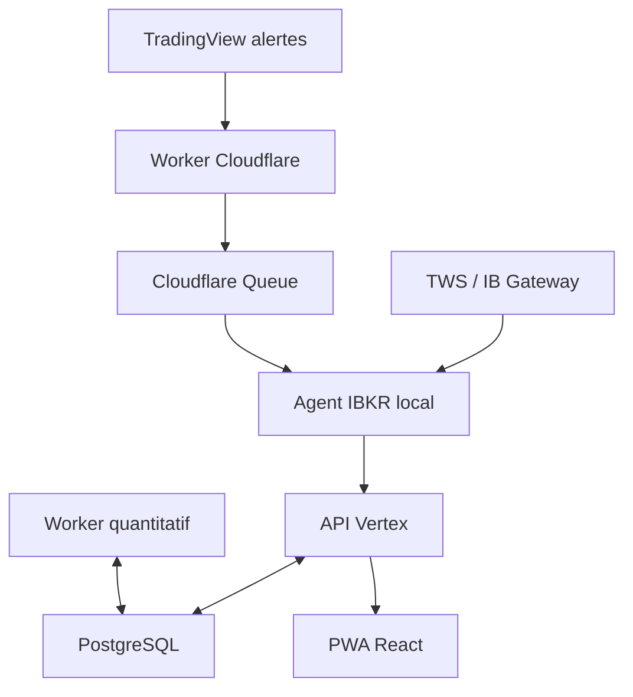

# Contexte système

## Architecture retenue

Quatre processus locaux existent : `api`, `worker`, `edge-ibkr`, `web`. Le Worker TradingView est le seul composant public. TWS et PostgreSQL ne publient aucun port réseau.

La PWA Beta est desktop-only sur le poste Vertex. Le téléphone sert uniquement à Claude Remote Control, hors système Vertex ; il n'accède ni à la PWA ni à l'API. Tailscale Serve et Funnel ne font pas partie du déploiement Beta. Une interface mobile éventuelle reste `LATER` et devra conserver les contrats canoniques.

## Data Fusion Hub

Le système collecte beaucoup mais affiche peu. Le pipeline d'information couvre :

- quotes, historique, contrats, options, Greeks et scanners IBKR ;
- actualités IBKR live/historiques et articles lorsque les droits API existent ;
- événements d'entreprise Wall Street Horizon lorsque l'abonnement est actif ;
- alertes techniques et données `request.*()` TradingView/Pine ;
- imports officiels TradingView : watchlists TXT, screeners CSV, graphiques CSV ;
- sources primaires autorisées : SEC/EDGAR, FRED/ALFRED et émetteurs/organismes retenus ;
- données manuelles : portefeuille, thèses, listes et annotations.

Toutes ces entrées sont normalisées, dédupliquées, reliées aux instruments et filtrées selon pertinence, droits et fraîcheur. Une information non accessible par API n'est jamais obtenue par scraping de l'interface TradingView ou TWS.

## Frontières réseau

- `edge-ibkr` ↔ TWS : `127.0.0.1` uniquement.
- applications locales ↔ PostgreSQL : réseau Compose interne.
- navigateur desktop local ↔ web/API : écoute locale uniquement, sans Tailscale Serve ni Funnel.
- TradingView ↔ Worker : HTTPS public, schéma strict, IP allowlist et secret de route.
- edge ↔ Cloudflare Queue : HTTPS sortant en pull.
- aucun workflow GitHub non approuvé ne s'exécute sur l'ordinateur où TWS est ouvert.
