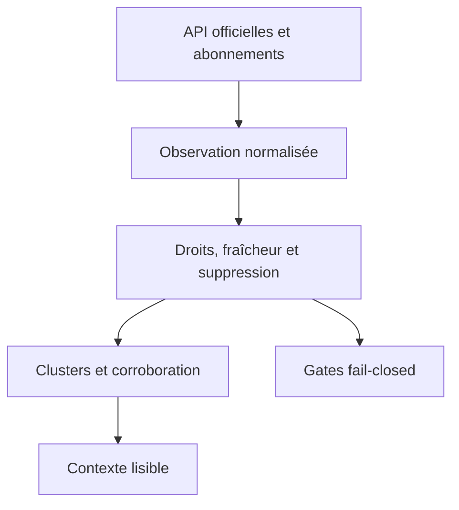

# Intelligence actualités, société, macro et social

Revue des sources officielles : 28 août 2026. Ce document définit une architecture d’information, pas un avis juridique. Les conditions et le contrat effectivement acceptés au moment de l’activation restent prioritaires.

## Décision produit

Vertex collecte beaucoup mais n’affiche que ce qui est pertinent, traçable et autorisé. Les sources primaires et souscrites établissent les faits ; les flux sociaux mesurent seulement l’attention et les récits.

Règles non négociables :

- aucun scraping d’interface, de page HTML ou de moteur de recherche ;
- aucune collecte par cookie ou session navigateur ;
- aucune utilisation d’un endpoint non documenté ;
- aucune redistribution d’un article ou post si le droit n’est pas explicite ;
- aucune donnée sociale privée, aucun message direct et aucune action d’écriture ;
- aucune donnée sociale pour entraîner ou ajuster un modèle ;
- aucun contournement de paywall, d’entitlement, de quota ou de limite de débit ;
- un sentiment social, même extrême, ne suffit jamais à produire `QUALIFIED`, modifier une gate ou déterminer la direction finale ;
- toute donnée conserve source, identifiant natif, licence/droit, `published_at`, `observed_at`, `received_at`, langue, fraîcheur et politique de suppression.

## Hiérarchie de preuve

| Niveau | Exemples | Rôle autorisé |
|---|---|---|
| P0 — source réglementaire/primaire | SEC EDGAR, observation FRED/ALFRED avec source auditée | établir un dépôt, un fait publié, une valeur et son vintage |
| P1 — source souscrite structurée | IBKR News, IBKR WSH | alerter, documenter une actualité ou un événement selon entitlement |
| P2 — agrégateur ouvert | GDELT | découvrir une couverture, mesurer sa diversité, retrouver les éditeurs |
| P3 — conversation publique | Bluesky, Reddit, X ; Stocktwits seulement si contrat futur | mesurer volume, vitesse, désaccord et risque de manipulation |
| P4 — inférence | sentiment, thèmes, résumé IA | expliquer une observation ; jamais établir seule un fait ou un verdict |

Une confirmation P3 + P3 reste sociale. Dix reposts du même article ne deviennent pas dix sources. Un fait est `PRIMARY_CONFIRMED` uniquement quand un P0/P1 compétent le confirme.

## Flux canonique

Les clusters informent l’utilisateur. Seules les données requises déjà autorisées par le moteur de décision peuvent entrer dans une gate ; un score social n’est jamais une donnée requise pour qualifier.

## Statut par défaut

| Source | Portée | Statut | Motif |
|---|---|---|---|
| IBKR News API | news live/historique/articles selon fournisseurs | `ACTIVE` sous entitlement | source souscrite prioritaire, sondée au démarrage |
| IBKR Wall Street Horizon | événements entreprise | `ACTIVE` sous entitlement | calendrier structuré prioritaire |
| SEC EDGAR | dépôts, XBRL, société et ETF US | `ACTIVE` | source réglementaire gratuite et directe |
| FRED/ALFRED | macro, calendrier et vintages | `ACTIVE` | source officielle ; droits à vérifier série par série |
| GDELT | couverture mondiale et diversité média | `ACTIVE` comme complément | données GDELT ouvertes ; texte des éditeurs exclu |
| Bluesky AT Protocol | conversation publique ciblée | `OPTIONAL` | public ne signifie pas autoritaire ; suppression à honorer |
| Reddit Data API | communautés publiques approuvées | `OPTIONAL` | approbation explicite, OAuth et rétention courte |
| X API | posts publics ciblés | `OPTIONAL` | compte développeur, coût à l’usage et obligations de conformité |
| Stocktwits | sentiment spécialisé | `UNSUPPORTED` | inscriptions API publiques fermées ; Firestream réservé aux comptes autorisés |

`ACTIVE` ne signifie pas « disponible ». L’adaptateur publie `NOT_ENTITLED` ou `ERROR` si la capacité réelle manque. Il ne substitue aucune autre source silencieusement.

## Sources prioritaires

### IBKR News API

**Portée.** Fournisseurs effectivement retournés par `reqNewsProviders`, titres live par instrument ou broad tape, titres historiques et corps d’article accessibles par `providerCode`/`articleId`.

**Authentification et coût.** Session TWS/IB Gateway locale authentifiée et abonnement API propre au fournisseur. Un abonnement visible dans TWS ne garantit pas l’accès API. La sélection et le coût sont vérifiés humainement dans le portail ; Vertex ne souscrit jamais automatiquement.

**Fraîcheur.** Événementielle pour les titres live, historique à la demande, sans SLA inventé. L’instant fournisseur et l’instant de réception sont distincts. Pacing, reconnexion et erreurs d’entitlement sont visibles.

**Rétention.** Par défaut, le corps n’est pas persisté ; il est affiché depuis un cache chiffré d’au plus 24 h. Le titre suit la même limite conservatrice. Vertex peut conserver l’identifiant fournisseur, l’identifiant article, l’instrument, les timestamps et une empreinte non reconstructible pendant 30 jours. Une durée supérieure exige que les conditions du fournisseur la permettent explicitement.

**Champs dérivés.** Liens d’entités, catégorie d’événement, nouveauté, proximité d’une watchlist, duplication, nombre de fournisseurs indépendants, âge et état de droit. Le sentiment fournisseur reste une observation nommée, jamais le verdict Vertex.

**Garde-fous.** N’appeler que les méthodes news documentées. Ne pas appeler compte, portefeuille, positions, P&L, ordres ou exécutions. Ne pas republier titre ou article, ne pas exporter un corpus et ne pas transmettre le contenu à un fournisseur IA sans droit écrit.

Sources primaires : [documentation TWS API actuelle](https://www.interactivebrokers.com/campus/ibkr-api-page/twsapi-doc/), [référence officielle News](https://interactivebrokers.github.io/tws-api/news.html), [gestion des abonnements données/recherche/news](https://www.interactivebrokers.com/campus/trading-lessons/subscribing-to-data/), [offres Research and News](https://www.interactivebrokers.com/en/pricing/research-news-services.php).

### IBKR Wall Street Horizon

**Portée.** Résultats, dividendes, splits, options expirations, conférences et autres événements d’entreprise exposés par les métadonnées et requêtes WSH.

**Authentification et coût.** Session TWS locale plus entitlement WSH éventuel. Le coût est variable et vérifié dans le portail. Les requêtes ciblent des `conId` ou l’univers Vertex ; `fillPortfolio` reste toujours désactivé pour ne jamais lire le portefeuille IBKR.

**Fraîcheur.** Réponses à la demande et révisions fournisseur. Vertex recharge au démarrage puis selon un planning borné et le pacing IBKR ; chaque changement crée une `EventRevision` plutôt que d’écraser l’histoire.

**Rétention.** Payload brut chiffré 24 h maximum. Événement normalisé conservé jusqu’à 30 jours après l’événement ; historique des révisions et preuve minimale jusqu’à un an si l’entitlement le permet. Une condition fournisseur plus stricte l’emporte.

**Champs dérivés.** Jours avant événement, fenêtre de risque, changement de date, certitude, conflit entre sources, instruments reliés. Aucun « earnings surprise » n’est inventé sans valeurs actual/consensus légalement obtenues.

**Garde-fous.** Ne pas utiliser les options de portefeuille, ne pas inférer une position, ne pas redistribuer le calendrier et ne pas traiter une date estimée comme confirmée.

Sources primaires : [documentation TWS API actuelle — Wall Street Horizon](https://www.interactivebrokers.com/campus/ibkr-api-page/twsapi-doc/), [événements WSH et fondamentaux](https://interactivebrokers.github.io/tws-api/fundamentals.html), [filtres WSH](https://interactivebrokers.github.io/tws-api/wshe_filters.html).

### SEC EDGAR

**Portée.** Historique des dépôts, métadonnées société, formulaires réglementaires et faits XBRL. Pour les ETF, EDGAR apporte les dépôts et documents officiels ; il ne garantit pas un flux normalisé complet de positions quotidiennes.

**Authentification et coût.** Pas de clé. Chaque requête porte un `User-Agent` déclarant l’application et un contact. La limite officielle actuelle est de 10 requêtes/s maximum ; Vertex vise moins, utilise cache conditionnel et archives bulk pour les volumes.

**Fraîcheur.** Les submissions sont mises à jour en temps réel avec un délai typique inférieur à une seconde, les API XBRL typiquement en moins d’une minute ; les bulk ZIP sont republiés la nuit. Ce sont des valeurs typiques, pas un SLA.

**Rétention.** Réponse brute 24 h sauf besoin d’audit. Accession, CIK, formulaire, date et faits XBRL peuvent être conservés durablement avec provenance. Un contrôle hebdomadaire absorbe les corrections et suppressions post-acceptation ; une copie retirée n’est plus affichée. Les données de personnes physiques dans les formulaires sont minimisées.

**Champs dérivés.** Événements de dépôt, deltas de faits, période fiscale, qualité XBRL, changements de nom/ticker et liens entreprise/ETF. Les ratios financiers sont calculés par `vertex_core` Python, versionnés et sourcés à l’accession.

**Garde-fous.** Utiliser `data.sec.gov`, indexes ou archives officiellement documentés ; pas la recherche HTML. Ne pas résumer un dépôt comme un fait certain sans lien vers les passages/faits sources. Respecter corrections, unités, taxonomie, période et amendements.

Sources primaires : [API EDGAR](https://www.sec.gov/search-filings/edgar-application-programming-interfaces), [accès et Fair Access](https://www.sec.gov/search-filings/edgar-search-assistance/accessing-edgar-data), [ressources développeurs SEC](https://www.sec.gov/about/developer-resources).

### FRED et ALFRED

**Portée.** Séries macroéconomiques, observations, calendrier de publications, métadonnées et vintages. ALFRED conserve les valeurs telles qu’elles étaient publiées avant révision et doit être utilisé pour tout backtest point-in-time.

**Authentification et coût.** Clé API FRED par application/utilisateur selon la version utilisée ; inscription gratuite. La revue humaine des droits de chaque série est obligatoire car certaines séries appartiennent à des tiers.

**Fraîcheur.** Propre à chaque publication. Une date de release ne garantit pas l’heure de disponibilité dans FRED. Le connecteur lit `last_updated`, les dates temps réel/vintage et respecte les réponses de rate limit sans boucle agressive.

**Rétention.** Métadonnées, observations et vintages peuvent être conservés durablement seulement si les droits de la série le permettent. Une série dont les notes mentionnent un copyright reste limitée à l’usage personnel autorisé ; cache brut 24 h et aucune redistribution par défaut. Attribution FRED et source d’origine obligatoires.

**Champs dérivés.** Variation, z-score point-in-time, régime macro, révision, ancienneté de la dernière observation et proximité d’une publication. Une « surprise » exige une prévision consensus obtenue d’une autre source autorisée ; elle ne peut pas être déduite de FRED seul.

**Garde-fous.** Allowlist de séries avec propriétaire, copyright, unité, fréquence et politique de redistribution. Aucun calcul sur la dernière version d’une série pour simuler ce qui était connu historiquement.

Sources primaires : [API FRED/ALFRED](https://fred.stlouisfed.org/docs/api/fred/), [ALFRED et vintages](https://fred.stlouisfed.org/docs/api/fred/alfred.html), [conditions API](https://fred.stlouisfed.org/docs/api/terms_of_use.html), [mentions légales et attribution](https://fred.stlouisfed.org/legal/), [clés API](https://fred.stlouisfed.org/docs/api/fred/v2/api_key.html).

### GDELT

**Portée.** Découverte de couverture mondiale, langues, domaines éditeurs, thèmes, événements et tonalité GDELT. Vertex utilise DOC 2.0 et, si nécessaire, les datasets GDELT officiels ; il ne télécharge pas les articles des éditeurs.

**Authentification et coût.** Pas de clé ni frais GDELT publiés. Coût interne : requêtes bornées, attribution et contrôle de qualité. Les datasets GDELT sont annoncés comme libres d’usage académique, commercial ou gouvernemental, avec citation et lien obligatoires.

**Fraîcheur.** GDELT 2.0 annonce des mises à jour toutes les 15 minutes. DOC 2.0 expose une fenêtre glissante pouvant aller jusqu’aux trois derniers mois. Vertex n’interprète pas cela comme une garantie d’exhaustivité.

**Rétention.** Réponse brute 24 h, métadonnées GDELT et URL canonique jusqu’à un an, agrégats non personnels jusqu’à cinq ans. Aucun texte, image ou paywall d’éditeur n’est copié : leurs droits ne sont pas transférés par GDELT.

**Champs dérivés.** Vélocité de couverture, diversité de pays/langues/domaines, concentration, nouveauté, thèmes, tonalité GDELT identifiée comme telle, liens d’entités et corroboration par source primaire.

**Garde-fous.** Un article syndiqué compte une seule fois ; l’éditeur d’origine reste visible. La tonalité GDELT n’est ni un sentiment investisseur ni un signal de direction. Toute lecture de l’article se fait par lien externe sous les droits de l’éditeur.

Sources primaires : [présentation et conditions GDELT](https://www.gdeltproject.org/about.html), [données GDELT](https://www.gdeltproject.org/data.html), [DOC 2.0](https://blog.gdeltproject.org/gdelt-doc-2-0-api-debuts/), [GDELT 2.0 et cadence](https://blog.gdeltproject.org/gdelt-2-0-our-global-world-in-realtime/).

## Sources sociales optionnelles

### Bluesky / AT Protocol

**Portée.** Posts publics ciblés par instruments, sociétés et événements via AppView public ; Jetstream/firehose n’est envisagé qu’après mesure du besoin. Aucun profil complet, blob, message privé ni graphe social global.

**Authentification et coût.** Les endpoints publics documentés peuvent être interrogés sans authentification via `public.api.bsky.app`; OAuth seulement si une future fonction utilisateur le requiert, ce qui n’est pas le cas ici. Coût humain : modération, suppression et surveillance des limites propres au service.

**Fraîcheur.** AppView à la demande ou événement quasi temps réel, sans SLA. Les limites publiées et en-têtes de réponse sont respectés et ne sont jamais contournés.

**Rétention.** Texte brut 24 h, URI/CID/DID et métadonnées nécessaires sept jours, agrégats réversibles 30 jours. Une suppression de record, suppression/désactivation de compte ou takedown purge contenu et dérivés dès réception, au plus tard sous 24 h selon la politique Vertex.

**Champs dérivés.** Mentions d’entités, langue, volume, vitesse, divergence, duplication et risque d’automatisation au niveau contenu. Aucun croisement d’identité avec une autre plateforme.

**Garde-fous.** Les repositories sont publics mais le contenu reste celui des utilisateurs. Ne pas archiver les médias, ne pas entraîner un modèle, respecter labels/modération et vérifier l’état actif avant affichage.

Sources primaires : [hôtes API et authentification](https://docs.bsky.app/docs/advanced-guides/api-directory), [limites de débit](https://docs.bsky.app/docs/advanced-guides/rate-limits), [consommation du firehose](https://docs.bsky.app/docs/advanced-guides/firehose), [cycle de vie des comptes](https://atproto.com/specs/account), [repositories et suppressions](https://atproto.com/specs/repository), [conditions Bluesky](https://bsky.social/about/support/tos).

### Reddit Data API

**Portée.** Posts et commentaires publics d’une allowlist étroite de communautés financières, seulement pour le cas d’usage approuvé par Reddit. Aucun message privé, vote, action de modération ou écriture.

**Authentification et coût.** Approbation explicite, client OAuth enregistré et `User-Agent` descriptif. L’usage gratuit éligible est limité officiellement à 100 requêtes/minute par client OAuth en moyenne sur dix minutes. Un usage commercial requiert permission et contrat ; un accès plus large peut être payant.

**Fraîcheur.** Listings et recherches à la demande, sans promesse d’exhaustivité. Lire les en-têtes `X-Ratelimit-*`, appliquer backoff et couper la source si l’approbation expire.

**Rétention.** Texte, auteur et métadonnées au plus 24 h ; purge planifiée stricte avant 48 h. Toute suppression de post/comment entraîne la suppression de tout contenu associé ; toute suppression de compte enlève identifiant et informations d’auteur. Les agrégats restent courts et réversibles, ou sont recalculés après purge.

**Champs dérivés.** Volume par communauté, diversité d’auteurs, duplication, vitesse, polarité expérimentale, désaccord et risque de campagne coordonnée. Pas de profilage individuel ni d’inférence de caractéristique sensible.

**Garde-fous.** Pas de scraping, pas d’entraînement IA, pas de commercialisation sans accord écrit, pas de ré-identification et pas de rapprochement avec des identifiants hors Reddit.

Sources primaires : [Data API Wiki et limites](https://support.reddithelp.com/hc/en-us/articles/16160319875092-Reddit-Data-API-Wiki), [accès, coût et restrictions](https://support.reddithelp.com/hc/en-us/articles/14945211791892-Developer-Platform-Accessing-Reddit-Data), [Responsible Builder Policy](https://support.reddithelp.com/hc/en-us/articles/42728983564564-Responsible-Builder-Policy), [Data API Terms](https://redditinc.com/policies/data-api-terms), [API documentée](https://www.reddit.com/dev/api/).

### X API

**Portée.** Recent Search sur sept jours et/ou Filtered Stream pour une allowlist de cashtags, sociétés et événements. Aucun DM, métrique privée, action d’écriture ou collecte d’un utilisateur protégé.

**Authentification et coût.** Compte développeur approuvé, projet/app et OAuth 2.0 App-Only bearer token. Le modèle officiel actuel est pay-per-use par crédits ; un plafond humain mensuel est obligatoire avant activation.

**Fraîcheur.** Stream temps réel ou recherche récente, sans garantie d’exhaustivité. Rate limits et facturation sont deux limites séparées ; Vertex respecte les deux et coupe avant dépassement du budget.

**Rétention.** Contenu brut 24 h. Identifiants et agrégats réversibles jusqu’à 30 jours uniquement si le cas d’usage approuvé le permet. Toute suppression ou modification est propagée dès que raisonnablement possible et au plus tard 24 h après notification/demande ; l’affichage relit la version courante.

**Champs dérivés.** Volume, vitesse, liens partagés, diversité apparente, duplication, divergence et score de qualité du corpus. L’identification publique de bots, spam ou violation des règles X est interdite sans permission écrite ; Vertex se limite à des signaux internes de concentration/duplication non accusatoires.

**Garde-fous.** Déclarer exactement le cas d’usage, ne pas dépasser les limites, ne pas retirer les marques requises, ne pas entraîner un modèle et ne pas utiliser le contenu pour profiler ou cibler des personnes.

Sources primaires : [introduction X API](https://docs.x.com/x-api/introduction), [Search Posts](https://docs.x.com/x-api/posts/search/introduction), [Filtered Stream](https://docs.x.com/x-api/posts/filtered-stream/introduction), [authentification Search](https://docs.x.com/x-api/posts/search/integrate/overview), [prix à l’usage](https://docs.x.com/x-api/getting-started/pricing), [Developer Policy](https://docs.x.com/developer-terms/policy), [Developer Agreement](https://docs.x.com/developer-terms/agreement).

### Stocktwits

**Décision.** `UNSUPPORTED`. La page développeurs officielle indique que les nouvelles inscriptions ne sont pas acceptées pendant la revue des API, documentation et conditions. Une documentation Firestream officielle existe mais exige un compte Stocktwits autorisé. Cela ne constitue pas un droit d’accès pour Vertex.

**Conséquence.** Aucun endpoint, cookie, page, websocket observé dans le navigateur ni API non documentée n’est utilisé. L’intégration ne pourra devenir `OPTIONAL` qu’après contrat/autorisation écrite, identifiants officiels, tarifs, limites et règles de rétention consignés dans un ADR.

Sources primaires : [statut des inscriptions développeur](https://api.stocktwits.com/developers), [documentation Firestream](https://firestream-portal.stocktwits.com/), [documentation API officielle](https://api-docs.stocktwits.com/).

## Contrats normalisés

### `ExternalContentObservation`

Champs minimaux :

- `source_id`, `native_id`, `canonical_url`, `content_kind` ;
- `instrument_ids`, `entity_ids`, `event_ids` et confiance de liaison ;
- `published_at`, `observed_at`, `received_at`, `updated_at` en UTC ;
- `language`, `publisher`, `author_pseudonym` seulement si autorisé ;
- `access_right`, `entitlement`, `retention_class`, `delete_by` ;
- `content_hash`, `syndication_hash`, `source_tier`, `quality_state` ;
- `is_deleted`, `is_modified`, `moderation_state` et `provenance`.

Le texte brut est séparé, chiffré et soumis au TTL de la source. Il n’entre jamais dans les logs, captures, fixtures ou exports.

### `ContentCluster`

Un cluster conserve : identifiants de toutes les observations, éditeur d’origine, articles syndiqués, sources indépendantes, faits primaires liés, contradictions et instant de dernière vérification. L’IA peut produire un résumé structuré seulement après le regroupement déterministe et doit citer les observations encore accessibles.

### `SocialPulse`

`SocialPulse` contient une fenêtre, volume, vitesse, diversité, concentration, désaccord, risque d’automatisation, couverture par source et incertitude. Il porte toujours `context_only: true`. L’API et l’interface rejettent un objet social sans cette valeur.

## Déduplication et corroboration

1. Dédupliquer d’abord par identifiant natif et URL canonique.
2. Regrouper les éditions par hash normalisé tout en conservant les versions.
3. Identifier la syndication par URL source, titre, timestamps et similitude ; ne pas supprimer irréversiblement.
4. Résoudre entreprise/instrument avec identifiants canoniques, jamais le ticker seul.
5. Compter des domaines éditoriaux indépendants, pas des reposts ni agrégateurs multiples d’un même article.
6. Chercher une confirmation P0/P1 ; sinon marquer `UNVERIFIED_SOCIAL`.
7. Si les sources compétentes divergent, publier `CONTRADICTED`, fermer la gate concernée et montrer les preuves.

## Détection bot, spam et manipulation

La détection sert à réduire le poids d’un corpus, pas à accuser une personne.

Signaux autorisés selon chaque contrat :

- répétition exacte ou quasi exacte ;
- rafales temporelles irréalistes ;
- même lien poussé par de nombreux comptes récents, si l’âge est fourni légalement ;
- concentration excessive sur quelques auteurs/domaines ;
- engagements disproportionnés et absence de diversité linguistique ;
- coordination observée entre messages publics sans relier des identités hors plateforme ;
- divergence forte avec news indépendantes et sources primaires.

Sortie : `automation_risk = LOW | MEDIUM | HIGH | UNKNOWN`, raisons observables et couverture. `UNKNOWN` est obligatoire si les champs nécessaires manquent. Pour X, aucune étiquette « bot », « spam » ou « violation » n’est produite sans autorisation écrite spécifique ; seuls duplication, concentration et qualité du corpus sont utilisés en interne.

## Effet sur l’analyse et le verdict

- Un dépôt SEC, une publication macro ou un événement WSH peut déclencher une réévaluation des données requises.
- Une news IBKR peut déclencher une collecte de faits et une fenêtre de risque, mais son sentiment ne tranche pas la direction.
- GDELT peut augmenter la priorité de lecture par diversité de couverture, jamais la confiance financière à lui seul.
- Un `SocialPulse` peut ajouter un avertissement « attention/manipulation possible » et réduire la confiance d’affichage.
- Un signal social ne peut jamais faire passer `BLOCKED`, `INSUFFICIENT_DATA`, `OBSERVE` ou `REVIEW` à `QUALIFIED`.
- Un conflit non résolu entre source primaire et social donne la priorité à la source primaire et affiche le conflit.

## Activation opérationnelle

Avant d’activer une source :

1. revalider les liens et conditions à la date du déploiement ;
2. obtenir approbation/contrat et définir le coût maximal si nécessaire ;
3. renseigner propriétaire, entitlement, finalité, territoires, TTL et procédure de suppression ;
4. tester quota, 401/403/429, suppression, modification, panne et fin d’abonnement ;
5. prouver qu’aucun contenu n’entre dans l’IA, les logs ou les sauvegardes au-delà de son droit ;
6. afficher `NOT_ENTITLED`, `UNSUPPORTED`, `DELAYED` ou `ERROR` sans fallback silencieux.

Le registre machine lisible est `manifests/news-social-sources.yaml`. La politique de droits et de rétention est détaillée dans `SOURCE_RIGHTS_AND_RETENTION.md`.
