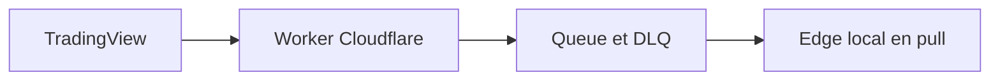

# Intégration TradingView

## Rôle

TradingView apporte la lecture technique, les alertes Pine, les screeners et des exports manuels autorisés. Une alerte est un déclencheur riche, pas un verdict et pas une source canonique de prix.

## Pack Pine prévu

Après un proof of concept sur les limites du plan actif :

- `vertex_market_sensor.pine` : OHLCV, régime, niveaux et conditions techniques ;
- `vertex_company_sensor.pine` : earnings, dividendes, splits et faits financiers choisis ;
- `vertex_macro_sensor.pine` : données économiques ciblées ;
- `vertex_alert_contract.pine` : fonction unique de message JSON v1.

Chaque script transporte `schema`, `alert_id`, `script_version`, `sent_at`, `bar_time`, exchange, ticker, interval, valeurs, unités et condition. Une modification de script impose de recréer l'alerte.

Pine permet notamment `request.security`, `request.financial`, `request.economic`, `request.earnings`, `request.dividends`, `request.splits` et `request.footprint`, mais impose des limites de calcul et de requêtes. Les scripts ciblent donc les watchlists importantes, pas tout le marché.

## Ingress

Le Worker exige POST, JSON, moins de 16 Ko, schéma strict, IP allowlist officielle, secret de route, fenêtre temporelle, clé de déduplication et rate limit. Il retourne `202` seulement après l'écriture Queue. Aucun calcul financier n'y vit.

L'edge accuse réception après commit PostgreSQL, reprend une quote IBKR fraîche puis demande une réévaluation complète.

## Exports autorisés

- watchlists : TXT officiel ;
- screeners actions/ETF/Pine : CSV officiel ;
- graphiques et indicateurs visibles : CSV officiel.

Vertex fournit un assistant d'import avec aperçu, mapping d'instruments, dédoublonnage et provenance. Il ne pilote pas l'interface TradingView par automatisation de navigateur et ne scrape ni News Flow ni Calendars.

## Limites explicites

- webhooks : ports 80/443, délai inférieur à trois secondes, IPv4, 2FA ;
- livraison occasionnellement défaillante : surveiller l'Alert Log ;
- pas de secret ou compte dans le corps ;
- la richesse de l'abonnement UI n'est pas une licence d'API générale ;
- le Pine Screener est un outil de découverte/export, pas un flux backend illimité.

## Documentation officielle à conserver

- Webhooks d'alertes : https://www.tradingview.com/support/solutions/43000529348-how-to-configure-webhook-alerts/
- Données accessibles par `request.*()` en Pine : https://www.tradingview.com/pine-script-docs/concepts/other-timeframes-and-data/
- Limites Pine, y compris appels `request.*()` : https://www.tradingview.com/pine-script-docs/writing/limitations/
- Export du graphique en CSV : https://www.tradingview.com/support/solutions/43000537255-how-to-export-chart-data/
- Import/export de watchlist TXT : https://www.tradingview.com/support/solutions/43000487233-how-to-import-or-export-a-watchlist/
- Export du Screener : https://www.tradingview.com/support/solutions/43000474432-how-to-export-screener-data/
- Consommateur HTTP pull Cloudflare Queues : https://developers.cloudflare.com/queues/configuration/pull-consumers/
