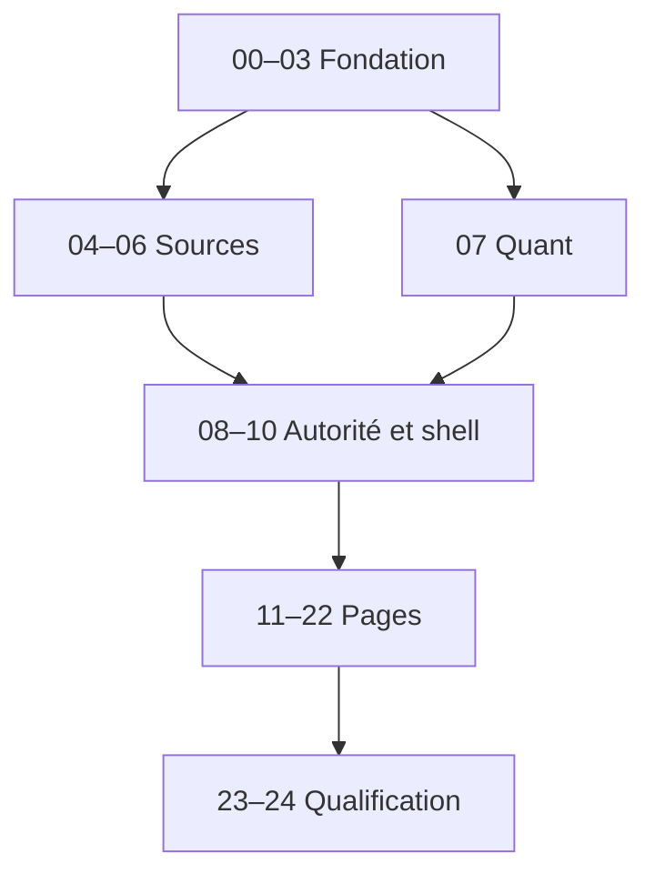

# Matrice des dépendances de livraison

## Graphe canonique

| Producteur | Contrat produit | Consommateurs autorisés | Consommateurs interdits |
|---|---|---|---|
| Edge IBKR | observations brutes normalisées | ingestion API | UI, IA, `AdviceEngine` direct |
| Ingress TradingView | événements et imports validés | ingestion API | TWS, base, décision directe |
| Data Fusion | faits, clusters, événements, couverture | quant, décision, API | mutation des sources brutes |
| Qualité des données | statut, âge, conflits, couverture | gates, API, UI | remplacement silencieux d'une valeur |
| Moteur quantitatif | résultats versionnés | gates, `AdviceEngine`, API | TypeScript autoritaire |
| `AdviceEngine` | `AdviceResult` unique | API, UI, IA explicative | Edge, scripts Pine, frontend alternatif |
| API | DTO OpenAPI et signaux SSE | PWA desktop Beta ; futurs clients `LATER` compatibles | calcul financier concurrent, fork mobile des contrats |
| PWA | intention utilisateur, affichage | API uniquement | IBKR, PostgreSQL, Worker directs |
| Vertex AI | explication et citations | PWA | verdict, source brute, ordre |

## Dépendances de lots

Les pages peuvent être développées dans des branches séparées uniquement si chacune part du même LOT-10 fusionné. Leur fusion reste séquentielle pour éviter la dérive du shell et des contrats.

La Beta Vertex 1.0 ne livre qu'une UI desktop. Un éventuel client mobile reste `LATER` et réutilise les mêmes schémas OpenAPI, états de qualité et identités ; aucun DTO métier parallèle n'est anticipé dans la Beta.

## Règles d'import

- `domain` n'importe jamais FastAPI, SQLAlchemy, IBKR, Cloudflare ou React.
- `quant` dépend de contrats du domaine, jamais des DTO HTTP.
- `application` orchestre les ports du domaine ; les adapters les implémentent.
- `persistence` ne contient aucune règle de décision.
- `web` consomme le client OpenAPI généré ; aucun appel HTTP ad hoc.
- `research` lit des snapshots exportés ; il n'écrit jamais dans les schémas live.
- tout cycle d'import ou dépendance inversée bloque la PR.
